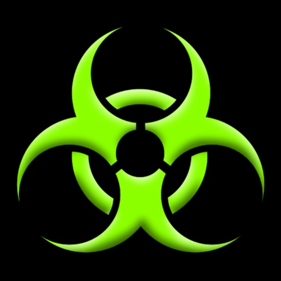

<h4 align="center">
<a href="https://github.com/felipefarinha/poisontheme" style="color: #83e509;">Poison</a>
·
<a href="#" style="color: #83e509;">Ambience </a>(feat)
·
<a href="#" style="color: #83e509;">Immortal </a>(feat)
·
<a href="https://github.com/felipefarinha/poisontheme" style="color: #83e509;">GitHub </a>

</h4>

---

  <br />
  <br />
  <br />
  <br />

<p align="center"></p>
<h3 align="center">Poison Dark Theme</h3>
<h4 align="center">Faça seu código brilhar com o tema Poison. Um tema escuro que vai deixar seu ambiente de desenvolvimento envenenado. Contamine seu VsCode</h4>

  <br />
  <br />

### Prévia do tema | Theme preview

<span style="text-align: center;">


</span>

</div>

<br />

### Instalação | Installation

1. Clique `Ctrl`+`Shift`+`X`
1. Digite **Poison**
1. Clique `instalar`

---

1. Open Extensions sidebar panel in VS Code. View → Extensions `Ctrl`+`Shift`+`X`
1. Search for **Poison**
1. Click Install to install it.
1. Click Reload to reload the editor.
1. File > Preferences > Color Theme > **Poison**

### Configurações recomendadas | Recommendation config

```json
{
  "workbench.colorTheme": "Poison",
  "editor.fontFamily": "Fira Code Retina, JetBrains Mono",
  "editor.fontSize": 16,
  "editor.lineHeight": 2,
  "editor.tabSize": 2,
  "editor.wordWrap": "on",
  "workbench.startupEditor": "newUntitledFile",
  "window.zoomLevel": 0,
  "editor.cursorBlinking": "smooth",
  "editor.cursorSmoothCaretAnimation": "on",
  "editor.guides.bracketPairs": "active",
  "editor.bracketPairColorization.enabled": false,
  "workbench.activityBar.location": "top"
}
```

- Fonte: <a href="https://pt.ffonts.net/Fira-Code-Retina.font">Fira Code Retina</a>
- Fonte: <a href="https://www.jetbrains.com/lp/mono">Fonte JetBrains Mono</a>
- Fonte: <a href="https://marketplace.visualstudio.com/items?itemName=miguelsolorio.symbols">Symbols</a>

### Contribuir | Contribute

Encontrou um problema? Gostaria de propor uma melhoria? <a href="https://github.com/felipefarinha/poisontheme/issues">Abra uma issue</a> de contribuição para que essas mudanças aconteçam. Obrigado!

### Licença

<a href="./LICENSE">MIT LICENSE</a> © Poison Dark Theme. 🐍 Developed by <a href="https://github.com/felipefarinha" style="color: #83e509;">@Fahryn</a>
